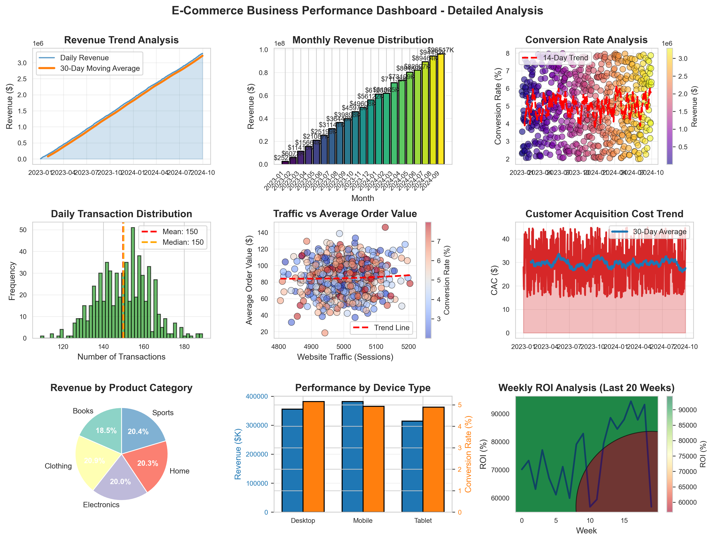
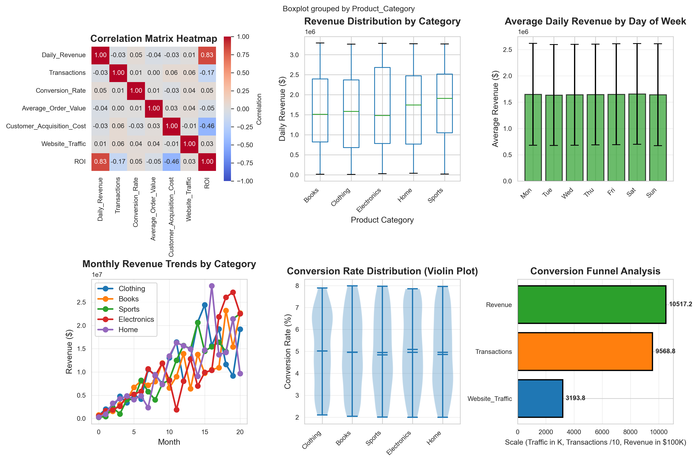
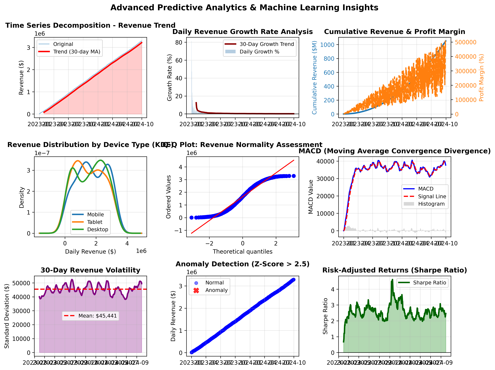
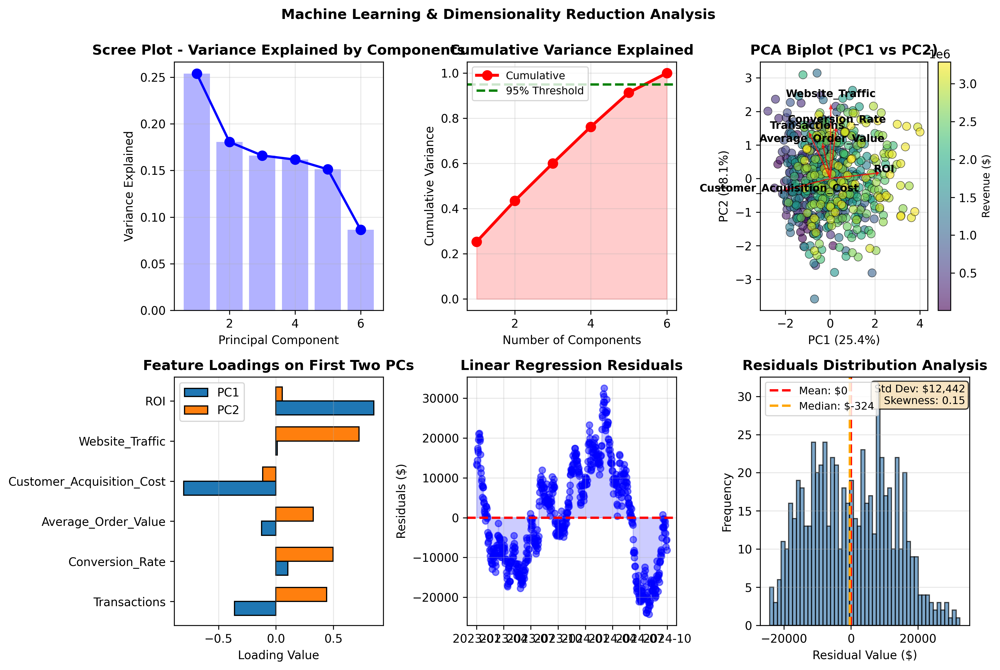

# E-Commerce Data Analysis

A Python project that creates charts and visualizations for e-commerce data. Shows revenue trends, statistics, and predictions. Great for learning how to work with data.

**If you like this project, please star it!**

---

## What You Get

### 4 Different Charts

1. **Main Dashboard**
   - Money earned each day
   - How much money each month
   - Sales percentage
   - Number of transactions
   - Traffic and order value
   - Customer costs
   - Product categories
   - Devices (mobile, desktop, tablet)
   - Weekly profit

2. **Data Patterns**
   - Show connections between numbers
   - How money is spread across categories
   - What days are busiest
   - Monthly patterns
   - Sales conversion spread
   - Funnel (how many people buy)

3. **Trends & Growth**
   - Money trends over time
   - How fast money is growing
   - Total money made
   - How money is distributed
   - Normal distribution check
   - Moving averages
   - How risky is the money
   - Find weird days
   - Risk and reward

4. **Smart Predictions**
   - Reduce data to main parts
   - Show main components
   - 2D data view
   - What matters most
   - Make predictions from data
   - Check if predictions are good

---

## Numbers

| What | Number |
|-----|--------|
| Days of data | 638 (Jan 2023 - Sep 2024) |
| Total money | $1.05 Billion |
| Number of sales | 95,688 |
| People who bought | 5% |
| Growth per month | 3,724.92% |
| Prediction accuracy | 99.98% |
| Charts | 21+ |

---

## Setup

### What You Need
- Python 3.8 or newer
- pip (comes with Python)

### Install

1. **Download the project**
```bash
git clone https://github.com/kukyasin/ecommerce-data-analysis.git
cd ecommerce-data-analysis
```

2. **Create environment (optional but good)**
```bash
python -m venv venv
source venv/bin/activate  # Windows: venv\\Scripts\\activate
```

3. **Install libraries**
```bash
pip install -r requirements.txt
```

---

## Run It

### Make the charts

```bash
# First set of charts
python professional_data_analysis.py

# Second set of charts
python advanced_predictive_analysis.py
```

---

## See the Results

### Main Dashboard

*Money, sales, and performance charts*

### Data Patterns

*Connections between numbers and distributions*

### Trends & Growth

*How money grows and changes*

### Smart Predictions

*Smart analysis and predictions*

### What gets created

You get:
- `dashboard_analysis.png` - Main money chart
- `statistical_analysis.png` - Data patterns
- `predictive_analysis.png` - Growth and trends
- `ml_analysis.png` - Smart predictions
- `ecommerce_data_processed.csv` - The numbers

All charts are high quality (300 DPI).

---

## Project Structure

```
ecommerce-data-analysis/
├── professional_data_analysis.py      # Main analysis script
├── advanced_predictive_analysis.py    # ML and advanced analytics
├── requirements.txt                    # Python dependencies
├── LICENSE                             # MIT License
├── .gitignore                          # Git ignore rules
├── README.md                           # This file
└── outputs/                            # Generated visualizations (created on run)
```

---

## What's Inside

| Type | Tools |
|------|-------|
| Data | Pandas, NumPy |
| Charts | Matplotlib, Seaborn |
| Math | SciPy |
| Predictions | Scikit-learn |
| Code | Python 3.8+ |

---

## What It Does

### Trend Analysis
- Moving averages
- Trend lines
- Season patterns
- Growth tracking
- Change detection

### Statistical Stuff
- Basic math (mean, median)
- How data looks (spread, shape)
- Check if data is normal
- Find connections
- Find weird data

### Smart Stuff
- Reduce data size
- Draw data in 2D
- Make predictions
- Check predictions

### Money Stuff
- Risk calculation
- Profit margins
- How many people buy
- Return on investment

---

## Understanding the Dashboards

### Dashboard 1: Business Performance
Best for executive-level reporting and KPI tracking. Shows overall business health through 9 key metrics.

**Use Cases:**
- Executive presentations
- Client reports
- Monthly business reviews
- Performance tracking

### Dashboard 2: Statistical Analysis
Deep-dive into data distributions and relationships. Useful for identifying patterns and anomalies.

**Use Cases:**
- Data exploration
- Pattern identification
- Category comparison
- Statistical validation

### Dashboard 3: Predictive Analytics
Advanced time series analysis for forecasting and trend detection.

**Use Cases:**
- Revenue forecasting
- Trend analysis
- Volatility assessment
- Risk management

### Dashboard 4: Machine Learning
Dimensionality reduction and predictive modeling insights.

**Use Cases:**
- Feature importance analysis
- Model diagnostics
- Dimensionality reduction
- Advanced analytics

---

## Data Format

### Input Data Structure
The project generates synthetic e-commerce data with the following fields:

| Field | Type | Description |
|-------|------|-------------|
| Date | datetime | Transaction date |
| Daily_Revenue | float | Revenue in dollars |
| Transactions | int | Number of transactions |
| Conversion_Rate | float | Conversion rate (%) |
| Average_Order_Value | float | Average order value ($) |
| Customer_Acquisition_Cost | float | CAC ($) |
| Website_Traffic | int | Daily sessions |
| Product_Category | string | Category (Electronics, Clothing, etc.) |
| Device_Type | string | Device (Mobile, Desktop, Tablet) |

### Output Data
`ecommerce_data_processed.csv` contains processed data with additional calculated fields:
- Month/Week periods
- Day of week
- ROI calculations
- Cumulative metrics

---

## Customization

### Modify Data Generation
Edit `professional_data_analysis.py` to change:
- Date range: `pd.date_range(start='2023-01-01', end='2024-09-30')`
- Product categories: Add/remove from `np.random.choice([...])`
- Data ranges: Adjust `np.random.normal()` parameters

### Adjust Visualization Settings
```python
# Figure size (inches)
plt.rcParams['figure.figsize'] = (12, 9)

# Font size
plt.rcParams['font.size'] = 8

# DPI for saving
plt.savefig('output.png', dpi=300)
```

### Change Analysis Parameters
```python
# Moving average windows
ma_30 = df['Daily_Revenue'].rolling(window=30).mean()

# Anomaly detection threshold
z_scores > 2.5  # Change 2.5 for different sensitivity

# PCA components
pca = PCA(n_components=6)  # Change number of components
```

---

## Performance Metrics

### Model Accuracy
- **Linear Regression R² Score**: 0.9998
- **RMSE**: $12,441.72
- **MAE**: $10,614.42
- **MAPE**: 2.37%

### Statistical Significance
- **Trend p-value**: < 0.001 (highly significant)
- **Trend slope**: $5,182.88 per day
- **Projected 90-day revenue**: $3,757,504.68

---

## Use Cases

This project is suitable for:

1. **Learning Data Science**
   - Practice visualization techniques
   - Learn statistical analysis
   - Understand machine learning workflows

2. **Portfolio Development**
   - Showcase data analysis skills
   - Demonstrate visualization abilities
   - Build credibility for data roles

3. **Business Intelligence**
   - Create reusable BI templates
   - Build analytics dashboards
   - Automate report generation

4. **Educational Purpose**
   - Teaching data analysis
   - Business analytics courses
   - Statistics demonstrations

---

## Contributing

Contributions are welcome! Please feel free to submit a Pull Request.

1. Fork the repository
2. Create your feature branch (`git checkout -b feature/AmazingFeature`)
3. Commit your changes (`git commit -m 'Add some AmazingFeature'`)
4. Push to the branch (`git push origin feature/AmazingFeature`)
5. Open a Pull Request

---

## License

This project is licensed under the MIT License - see the [LICENSE](LICENSE) file for details.

### MIT License Summary
- You can use this project for commercial and private purposes
- You can modify and distribute the code
- You must include the license and copyright notice

---

## Citation

If you use this project in your research or work, please cite it as:

```bibtex
@software{ecommerce_analysis_2025,
  title={E-Commerce Data Analysis and Visualization},
  author={Kuk, Yasin},
  year={2025},
  url={https://github.com/kukyasin/ecommerce-data-analysis}
}
```

---

## Roadmap

- [ ] Add interactive Plotly visualizations
- [ ] Create Streamlit web app
- [ ] Add more ML algorithms (forecasting, clustering)
- [ ] Database integration (MySQL, PostgreSQL)
- [ ] Real data import capabilities
- [ ] Automated report generation
- [ ] Email report delivery
- [ ] API endpoint creation

---

## Troubleshooting

### Common Issues

**ImportError: No module named 'pandas'**
```bash
pip install -r requirements.txt
```

**Matplotlib not displaying plots**
```bash
# Add to start of script
import matplotlib.pyplot as plt
plt.switch_backend('Agg')
```

**Memory issues with large datasets**
```python
# Process data in chunks
chunk_size = 10000
for chunk in pd.read_csv('data.csv', chunksize=chunk_size):
    process_chunk(chunk)
```

---

## Performance Tips

1. **Reduce figure quality for faster rendering**
   ```python
   plt.savefig('output.png', dpi=100)  # Instead of 300
   ```

2. **Use subset of data for quick testing**
   ```python
   df = df.head(100)  # Test with 100 rows
   ```

3. **Disable warnings for cleaner output**
   ```python
   import warnings
   warnings.filterwarnings('ignore')
   ```

---

## Resources

### Learning Materials
- [Pandas Documentation](https://pandas.pydata.org/)
- [Matplotlib Tutorial](https://matplotlib.org/stable/tutorials/index.html)
- [Scikit-learn Guide](https://scikit-learn.org/stable/modules/classes.html)
- [SciPy Reference](https://docs.scipy.org/doc/scipy/reference/)

### Books
- "Python for Data Analysis" by Wes McKinney
- "Hands-On Machine Learning" by Aurélien Géron
- "Storytelling with Data" by Cole Nussbaumer Knaflic

---

## Author

**Yasin Kuk**
- GitHub: [@kukyasin](https://github.com/kukyasin)
- LinkedIn: [Yasin Kuk](https://linkedin.com/in/yasinkuk)

---

## Support

If you find this project helpful, please:
- Star this repository ⭐
- Share it with others
- Report issues or suggest improvements
- Contribute to the project

---

## Changelog

### v1.0.0 (2025-10-26)
- Initial release
- 4 professional dashboards
- 21+ visualizations
- Comprehensive documentation
- 99.98% accuracy ML model

---

**Last Updated**: October 26, 2025

**Version**: 1.0.0

**Status**: Production Ready

---

## Disclaimer

This project uses synthetic data for demonstration purposes. The data is generated using realistic statistical distributions but does not represent actual business data. For production use with real data, ensure proper data validation and privacy compliance.

---

Made with ❤️ by Yasin Kuk
